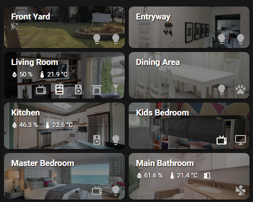

# Minimalistic Area Card

A minimalistic area card to have a control panel of your house on your dashboard. This card will show numeric sensors with its value, and binary sensors with only the icon. Switches and lights will have their own button that you can tap/click to toggle, or tap/click and hold to see detailed information.

[![GitHub Release][releases-shield]][releases]
[![License][license-shield]](LICENSE.md)
[](https://github.com/custom-components/hacs)





## Options

```yaml
 - type: custom:minimalistic-area-card
   title: Living Room
   image: /local/img/living-room.jpg #any image file on /config/www or an absolute image url
   tap_action:
      action: navigate
      navigation_path: /lovelace/living-room
   entities:
      - entity: media_player.living_room_tv
      - entity: switch.fireplace_on_off
      - entity: cover.window_covering
      - entity: media_player.speaker
      - entity: light.living_room_lamp
      - entity: sensor.hallway_humidity
      - entity: sensor.hallway_temperature
```


[commits-shield]: https://img.shields.io/github/commit-activity/y/junalmeida/homeassistant-minimalistic-area-card.svg?style=for-the-badge
[commits]: https://github.com/junalmeida/homeassistant-minimalistic-area-card/commits/master
[devcontainer]: https://code.visualstudio.com/docs/remote/containers
[discord]: https://discord.gg/5e9yvq
[discord-shield]: https://img.shields.io/discord/330944238910963714.svg?style=for-the-badge
[forum-shield]: https://img.shields.io/badge/community-forum-brightgreen.svg?style=for-the-badge
[forum]: https://community.home-assistant.io/c/projects/frontend
[license-shield]: https://img.shields.io/github/license/junalmeida/homeassistant-minimalistic-area-card.svg?style=for-the-badge
[maintenance-shield]: https://img.shields.io/maintenance/yes/2021.svg?style=for-the-badge
[releases-shield]: https://img.shields.io/github/release/junalmeida/homeassistant-minimalistic-area-card.svg?style=for-the-badge
[releases]: https://github.com/junalmeida/homeassistant-minimalistic-area-card/releases
